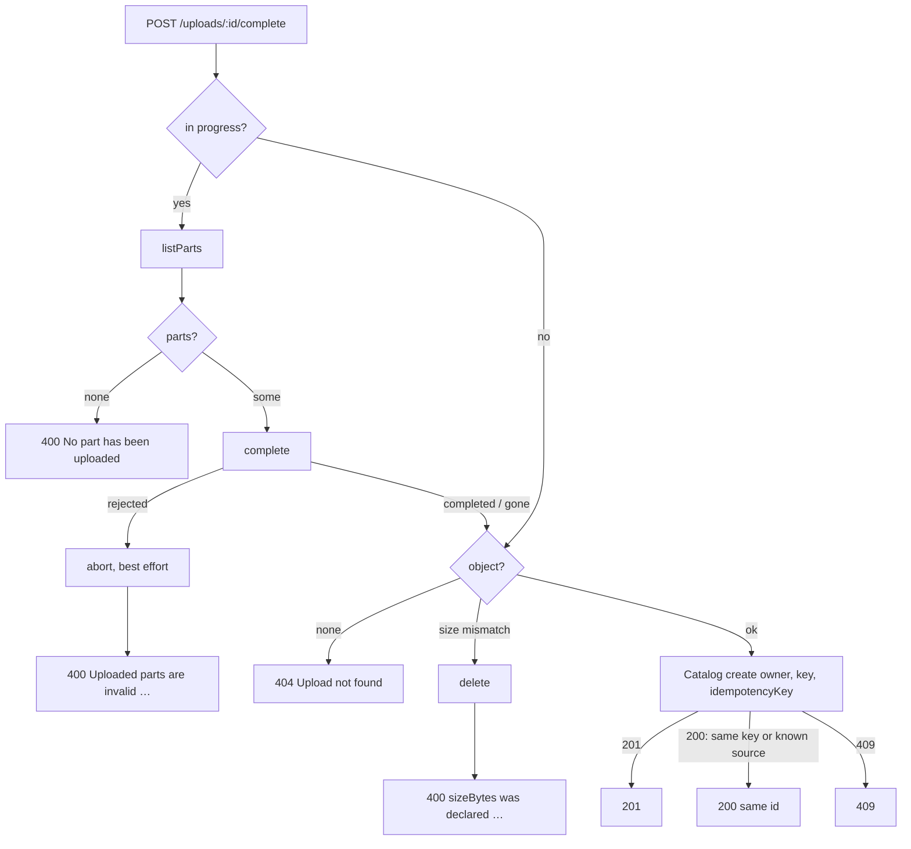

# API Hardening Design — api

**Spec**: `.specs/features/api-hardening/spec.md`
**Status**: Draft

---

## Architecture Overview

Most of this feature is tests and one lint rule. Three changes touch behaviour:

- The storage port learns that storage can **reject** a completion (HARD-01).
- The start-upload path compares `contentType` without case and stores it lowercase (HARD-03).
- The in-memory Catalog client mirrors the Catalog's new source dedup, so the API's e2e tests see the same contract as production (HARD-02).

HARD-02 needs no production change in the API. A second key on a completed upload finds no in-progress upload, then finds the object and calls create with the new key. The Catalog now answers `200` for the known source, and the API already maps `200` to `replayed`.

**Spike (2026-09-26, RustFS 1.0.0, SDK 3.1137.0).** Every refusal came back with HTTP status 400:

| Case | Error |
| --- | --- |
| Non-final part of 1 byte | `EntityTooSmall` |
| Wrong ETag | `InvalidPart` |
| Parts out of order | `InvalidPartOrder` |

`AbortMultipartUpload` after each refusal succeeded and left no in-progress upload. A 5 MiB non-final part completed.

---

## Code Reuse Analysis

### Existing Components to Leverage

| Component | Location | How to Use |
| --- | --- | --- |
| Error classifiers `isNoSuchUpload`, `isNotFound` | `src/storage/s3-upload-storage.ts:270-290` | Add `isRejectedParts` in the same style (by `name`/`Code`) |
| `S3Sender` injection | `src/storage/s3-upload-storage.ts:69` | Unit-test the `findObject` race with a fake sender that lists a key and then answers `NotFound` to the head |
| `CapturingLogger` | `test/support/capturing-logger.ts` | Assert the token is absent on the `503` and non-bearer paths |
| `auth-outage.e2e-spec.ts` | `test/` | Already stops the IdP; add the log assertion there |
| RustFS integration suite | `test/s3-upload-storage.e2e-spec.ts` | Add the rejected-parts, abort and unreachable-public-endpoint cases against real RustFS |
| `upload-flow.ts` | `test/support/upload-flow.ts` | Drive the second-key and invalid-parts flows end to end |

### Integration Points

| System | Integration Method |
| --- | --- |
| Object storage | New port method `abortMultipart`; `complete` can return `'rejected'` |
| `processing-catalog` | No contract change; relies on its HARD-09 for the second-key `200` |
| Lint gate | `no-console: error` for `src/**/*.ts` in `eslint.config.mjs` |

---

## Components

### `UploadStorage` port

- **Purpose**: Let storage say "your parts are wrong" separately from "I am down".
- **Location**: `src/storage/upload-storage.port.ts`
- **Interfaces**:
  - `complete(key, storageUploadId, parts): Promise<'completed' | 'gone' | 'rejected'>`: `'rejected'` when storage refuses the parts.
  - `abortMultipart(key, storageUploadId): Promise<void>`: aborting an upload that no longer exists is not an error.
- **Reuses**: The existing `'gone'` pattern.

### `S3UploadStorage`

- **Purpose**: Map `EntityTooSmall`, `InvalidPart` and `InvalidPartOrder` to `'rejected'`.
- **Interfaces**:
  - `complete` maps those three codes to `'rejected'`. Everything else except `NoSuchUpload` still throws `StorageUnavailableError`.
  - `abortMultipart` sends `AbortMultipartUploadCommand` through the **internal** client, and ignores `NoSuchUpload`.
- **Reuses**: `call`, `unavailable`.

### `InMemoryUploadStorage`

- **Purpose**: Behave like S3 for client-caused failures (candidate lesson L-010).
- **Interfaces**:
  - `complete` returns `'rejected'` when a non-final part is under 5 MiB (5 242 880 bytes, S3's minimum), when an ETag does not match, or when parts are out of order. The rejected upload stays in progress until aborted, as in S3.
  - `abortMultipart` drops the upload.

### `CompleteUploadService`

- **Purpose**: Turn `'rejected'` into the spec's `400`.
- **Change**: On `'rejected'`:
  1. Call `abortMultipart`. If it throws, catch and log only the error name: the bucket's 1-day rule discards the upload.
  2. Throw `BadRequestException('Uploaded parts are invalid: every part except the last must be 16777216 bytes')`.
- **Reuses**: `PART_SIZE_BYTES` for the number in the message.

### `StartUploadDto` / `StartUploadService`

- **Purpose**: Accept `contentType` without regard to case; store it lowercase.
- **Change**:
  - `matchesExtension` compares `value.toLowerCase()`.
  - The service passes `dto.contentType.toLowerCase()` to `startMultipart`.
  - A value with parameters still fails, because the whole value is compared.

### `InMemoryCatalogClient`

- **Purpose**: Mirror the Catalog's HARD-09, so the API's e2e tests exercise the same contract.
- **Change**: A create for an owner's known source with a new key returns `replayed` with the existing request.

### Lint rule

- **Purpose**: No `console` output from production code (HARD-05).
- **Change**: In `eslint.config.mjs`, a block `{ files: ['src/**/*.ts'], rules: { 'no-console': 'error' } }`.
- **Proof**: The build gate runs `npm run lint`. Insert a `console.log` into a scratch copy and lint must fail; this is the task's literal negative.

---

## Error Handling Strategy

| Error Scenario | Handling | User Impact |
| --- | --- | --- |
| Storage refuses the parts | `'rejected'` → abort → `400` | `400 Uploaded parts are invalid: every part except the last must be 16777216 bytes`; a retry gets `404` |
| The abort itself fails | Caught; only the error name is logged | Still `400`; the 1-day lifecycle rule cleans up |
| Any other completion error | `StorageUnavailableError` | `502 Storage unavailable`, unchanged |
| Object deleted between listing and head | `findObject` returns `undefined` | `404 Upload not found` (now tested) |
| Second key on a confirmed upload | The Catalog returns the existing request with `200` | `200`, same id |

---

## Risks & Concerns

| Concern | Location (file:line) | Impact | Mitigation |
| --- | --- | --- | --- |
| The e2e double threw a plain `Error` for invalid parts | `src/storage/in-memory-upload-storage.ts:133` | e2e suites could not see V28 | The double returns `'rejected'`; the RustFS integration suite proves the real codes |
| The two storage endpoints in tests reach one server | `test/s3-upload-storage.e2e-spec.ts` | Routing mistakes pass (V30) | New case: public endpoint `http://127.0.0.1:9` (nothing listens). Start, complete, abort and delete must succeed, and part URLs must name `127.0.0.1:9` |
| Existing e2e tests may upload several parts smaller than 5 MiB to the double | `test/complete-upload.e2e-spec.ts`, `test/support/upload-flow.ts` | They would start getting `400` | The double's sizes are numbers, not bytes: those tests declare 16 MiB non-final parts; every changed test is listed in its task |
| The log checks see only Nest's logger | `test/support/capturing-logger.ts` | `console.*` leaks pass (V29) | `no-console` lint rule on `src/` |
| Different RustFS or S3 versions may use other codes for bad parts | `s3-upload-storage.ts` | A new code would read as `502` again | The three AWS-documented codes are mapped, and the integration suite pins them against RustFS 1.0.0 |

---

## Tech Decisions

| Decision | Choice | Rationale |
| --- | --- | --- |
| Where "rejected parts" is decided | In the storage adapter, by S3 error code | The server enforces the rule; re-implementing its minimum size in the API would drift |
| Enforcing "nothing on the console" | ESLint `no-console` on `src/` | One rule covers every path; a capture test would cover only exercised paths |
| HARD-02 in the API | Tests only, plus the in-memory Catalog mirror | The HTTP client already maps the Catalog's `200` |
