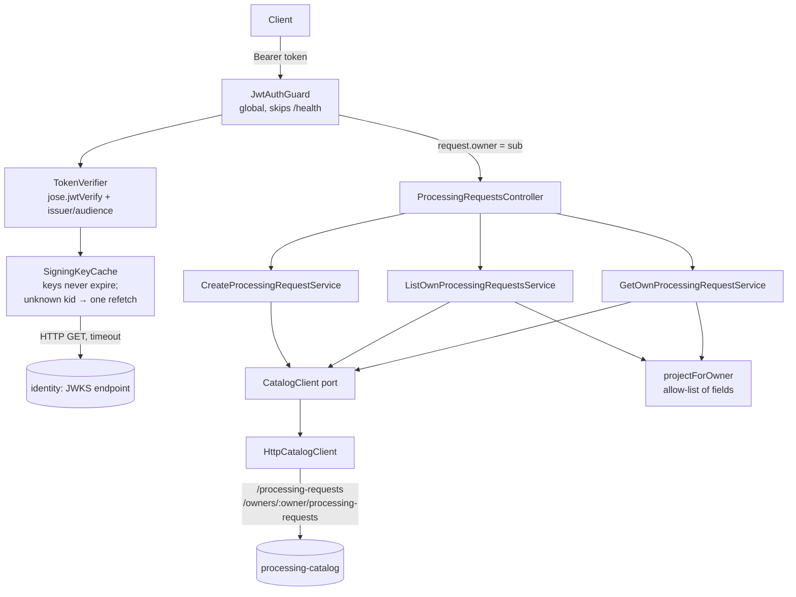

# Auth and Owner Scope Design — api

**Spec**: `.specs/features/auth-owner-scope/spec.md`
**Context**: `fiap-x-platform/.specs/features/auth-owner-scope/context.md` (locked decisions)
**Status**: Draft

---

## Project decisions this design conforms to

Read from `fiap-x-platform/.specs/STATE.md` `## Decisions`.

| Decision | How this design conforms |
| --- | --- |
| **AD-001** — services separated by responsibility | The API authenticates and projects; the Catalog stores and filters. The API holds no request data |
| **AD-003** — local DTOs, JSON between services, no shared package | The Catalog's owner-scoped response is re-declared here as a local type, not imported |
| **AD-005** — standard protocols, standard claims only | Validation is plain OIDC/JWKS through `jose`; the guard reads `sub`, `iss`, `aud`, `exp` and nothing else. No Keycloak SDK, adapter or claim |
| **AD-007** — the platform owns the topology | Issuer, audience and key-set URL arrive as environment variables set by `fiap-x-platform`'s compose |

**No new project-level decision is proposed.**

---

## Approaches considered (confirmed with the user on 2026-09-26)

| Approach | Verdict |
| --- | --- |
| **Global Nest guard + `jose` with a signing-key cache of our own (chosen)** | One dependency, the reference OIDC/JOSE library; the 401/503 split proven in the spike below |
| Passport + `passport-jwt` + `jwks-rsa` | Three dependencies, and `jwks-rsa`'s own cache and rate limiter hide the same distinction this design needs to make explicitly |
| `nest-keycloak-connect` | Couples the API to Keycloak and its proprietary claims — violates AD-005 |

### Spike evidence (2026-09-26, Keycloak 26.7.4 + `jose` 6.2.12)

| Case | `jose` outcome | This design maps it to |
| --- | --- | --- |
| Wrong `aud` / wrong `iss` | `JWTClaimValidationFailed` | 401 |
| Tampered payload | `JWSSignatureVerificationFailed` | 401 |
| Unknown `kid`, provider up | `JWKSNoMatchingKey` | 401 |
| Provider down, key already cached, cache never expiring | verifies | 200 (AC P1.8) |
| Provider down, unknown `kid`, `createRemoteJWKSet` | `JWKSNoMatchingKey` — **indistinguishable from the provider-up case** | must be 503 |
| Provider down, `createRemoteJWKSet` cache expired | `TypeError: fetch failed` even for a known key | breaks AC P1.8 |

The last two rows are why this design does not use `createRemoteJWKSet`: its cooldown skips the fetch that would reveal the outage, and its cache expiry turns an outage into a failure for keys it already had. The key cache below is small, and it owns exactly that behaviour.

---

## Architecture Overview



The guard is global and fail-closed: every route requires a token unless it is explicitly marked public, and the only public route is `/health`. A route added later is protected by default.

---

## Code Reuse Analysis

### Existing Components to Leverage

| Component | Location | How to Use |
| --- | --- | --- |
| `CatalogClient` port | `src/processing-requests/ports/catalog-client.port.ts` | Extend with `listOwned` and `getOwned`; `createProcessingRequest` is unchanged |
| `HttpCatalogClient` | `src/processing-requests/adapters/http-catalog-client.adapter.ts` | Same fetch-and-validate shape for the two new calls; `CatalogUnavailableError` on network or shape failure |
| `InMemoryCatalogClient` | `src/processing-requests/adapters/in-memory-catalog-client.adapter.ts` | Extend as the test double; owner filtering implemented in it so unit tests exercise isolation |
| `CatalogUnavailableError` → `502` | `src/processing-requests/services/create-processing-request.service.ts:24-26` | Same mapping for the new reads, one contract for "the Catalog failed" |
| `CatalogErrorFilter` | `src/processing-requests/filters/catalog-error.filter.ts` | Keeps shaping `502`; the new `401`/`503`/`404`/`400` come from standard Nest exceptions |
| Global `ValidationPipe` | `src/main.ts:7-13` | Validates the list query DTO; see the whitelist risk below |

### Integration Points

| System | Integration Method |
| --- | --- |
| Identity provider | `GET ${OIDC_JWKS_URL}` — the internal address (`http://identity:8080/realms/fiapx/protocol/openid-connect/certs`). **Not** discovery: the spike showed `.well-known` advertises `jwks_uri` on the public hostname (`localhost`), unreachable from inside the network |
| Catalog | Existing `POST /processing-requests`; new `GET /owners/:owner/processing-requests` and `GET /owners/:owner/processing-requests/:id` (AUTH-10 to AUTH-12) |

---

## Components

### OidcConfig

- **Purpose**: Reads `OIDC_ISSUER`, `OIDC_AUDIENCE`, `OIDC_JWKS_URL` and fails the process at startup if any is missing.
- **Location**: `src/auth/oidc.config.ts`
- **Interfaces**: `loadOidcConfig(env): OidcConfig` — throws naming the missing variable
- **Reuses**: nothing
- **Notes**: Fail-closed on purpose. This repository's `CATALOG_BASE_URL` falls back to an in-memory client when unset, and the Catalog once ran with a whole persistence layer unreferenced while every test passed; authentication must never have a silent "off" mode. Tests provide the three variables pointing at a local key set.

### SigningKeyCache

- **Purpose**: Resolves a `kid` to a public key; keys never expire, and an unknown `kid` triggers exactly one refetch.
- **Location**: `src/auth/signing-key-cache.ts`
- **Interfaces**:
  - `keyFor(header: JWSHeaderParameters): Promise<KeyLike>` — the resolver passed to `jose.jwtVerify`
  - throws `IdentityProviderUnavailableError` when a needed fetch fails or times out; throws `jose.errors.JWKSNoMatchingKey` when the refetched set still lacks the `kid`
- **Dependencies**: `jose` (`createLocalJWKSet`), `fetch` with `AbortSignal.timeout(OIDC_JWKS_TIMEOUT_MS, default 2000)`
- **Notes**: Concurrent refetches for the same miss share one in-flight promise. A refetch that succeeds replaces the set, so a rotated key is picked up (spec edge case). No time-based expiry: that is what keeps AC P1.8 true while the provider is down.

### TokenVerifier

- **Purpose**: Verifies a compact JWT and returns its `sub`.
- **Location**: `src/auth/token-verifier.ts`
- **Interfaces**: `verify(token: string): Promise<{ sub: string }>` — `jose.jwtVerify(token, cache.keyFor, { issuer, audience, algorithms: ['RS256'] })`; rejects a payload without a string `sub`
- **Notes**: Returns only `sub`. No other claim leaves this class, which makes AC P1.9 structural rather than a code-review promise. `exp` is enforced by `jose` with no clock tolerance configured.

### JwtAuthGuard and `@Public()`

- **Purpose**: Global guard: extracts `Authorization: Bearer <token>`, verifies it, stores `sub` on the request; maps failures to `401` or `503`.
- **Location**: `src/auth/jwt-auth.guard.ts`, `src/auth/public.decorator.ts`, registered as `APP_GUARD` in `src/auth/auth.module.ts`
- **Interfaces**: `canActivate(ctx): Promise<boolean>`; `@Public()` on `HealthController`; `@Owner()` param decorator returning the stored `sub`
- **Notes**: Guards run before pipes and handlers in Nest, so a rejected request never reaches validation or the Catalog client (AC P1.1–P1.7). Nothing about the token is logged (spec edge case); a rejection logs only the error class.

### ProcessingRequestsController (replaces `CreateProcessingRequestController`)

- **Purpose**: `POST /processing-requests`, `GET /processing-requests`, `GET /processing-requests/:id`, all owner-scoped.
- **Location**: `src/processing-requests/controllers/processing-requests.controller.ts`
- **Interfaces**:
  - `create(@Owner() owner, @Body() dto)` → `201 { processingRequestId, status }`
  - `list(@Owner() owner, @Query() q: ListQueryDto)` → `200 { items, page, pageSize, total }`
  - `get(@Owner() owner, @Param('id') id)` → `200 item` | `404`
- **Reuses**: the existing controller's filter and service wiring

### ListQueryDto

- **Location**: `src/processing-requests/dtos/list-query.dto.ts`
- `page`: integer ≥ 1, default 1; `pageSize`: integer 1–100, default 20. Messages name the parameter and its range (AC P3.7, P3.8).

### CreateProcessingRequestDto (changed)

- `ownerUserId` becomes `@IsOptional() @IsString()` and is never read. **It cannot simply be deleted**: `main.ts` sets `forbidNonWhitelisted: true`, so a body still carrying it would be rejected with `400` instead of ignored (AC P2.2).

### projectForOwner

- **Purpose**: Builds the user-facing item from whatever the Catalog returned, copying an allow-list of fields.
- **Location**: `src/processing-requests/projection.ts`
- **Interfaces**: `projectForOwner(item: CatalogOwnedItem): OwnedItem` — copies `processingRequestId`, `status`, `createdAt`, `updatedAt`, and `failureReason` only when `status === 'FAILED'`
- **Notes**: An allow-list, not a delete-list: a field the Catalog adds tomorrow cannot leak by default (AUTH-09).

---

## Data Models

```typescript
// src/auth
interface OidcConfig { issuer: string; audience: string; jwksUrl: string; jwksTimeoutMs: number }

// Catalog's owner-scoped response, re-declared locally (AD-003)
interface CatalogOwnedItem {
  processingRequestId: string
  status: 'RECEIVED' | 'QUEUED' | 'PROCESSING' | 'COMPLETED' | 'FAILED'
  createdAt: string
  updatedAt: string
  failureReason?: string
}
interface CatalogOwnedPage { items: CatalogOwnedItem[]; page: number; pageSize: number; total: number }

// What the user receives
type OwnedItem = Pick<CatalogOwnedItem, 'processingRequestId' | 'status' | 'createdAt' | 'updatedAt'> & { failureReason?: string }
interface OwnedPage { items: OwnedItem[]; page: number; pageSize: number; total: number }
```

### Configuration

| Variable | Default | Requirement |
| --- | --- | --- |
| `OIDC_ISSUER` | none — startup fails | AUTH-01 (`http://localhost:8080/realms/fiapx` in compose) |
| `OIDC_AUDIENCE` | none — startup fails | AUTH-01 (`fiapx-api`) |
| `OIDC_JWKS_URL` | none — startup fails | AUTH-02 (internal certs URL) |
| `OIDC_JWKS_TIMEOUT_MS` | `2000` | AUTH-03 |

---

## Error Handling Strategy

| Error Scenario | Handling | User Impact |
| --- | --- | --- |
| No/other-scheme `Authorization` | Guard → `UnauthorizedException` | `401` |
| `JWTExpired`, `JWTClaimValidationFailed`, `JWSSignatureVerificationFailed`, `JWSInvalid`, `JWTInvalid`, missing `sub` | Guard → `401` | `401`; Catalog not called |
| `JWKSNoMatchingKey` after a successful refetch | Guard → `401` | `401` |
| `IdentityProviderUnavailableError` (fetch failed / timed out when a key was needed) | Guard → `ServiceUnavailableException('Authentication temporarily unavailable')` | `503` |
| Invalid `page`/`pageSize` | `ValidationPipe` → `400` naming the field and range | `400`; Catalog not called |
| Catalog `404` on `getOwned` | Client returns `undefined` → `NotFoundException` with a fixed body | `404`, identical for another owner, missing or malformed id |
| Catalog unreachable / non-OK / bad shape | `CatalogUnavailableError` → `502` | `502` |

---

## Risks & Concerns

| Concern | Location (file:line) | Impact | Mitigation |
| --- | --- | --- | --- |
| **`forbidNonWhitelisted` rejects a removed field** | `src/main.ts:10` | Deleting `ownerUserId` from the DTO turns "ignored" (AC P2.2) into a `400` | Keep it as an optional, unread field; an e2e test posts `ownerUserId: "bob"` as `alice` and asserts `201` and owner = `alice` |
| **Silent fallback pattern** | `src/processing-requests/processing-requests.module.ts:9-16` (in-memory Catalog when `CATALOG_BASE_URL` is unset) | The same shape, applied to auth, would ship an API with authentication off | `OidcConfig` fails startup; a composition e2e test asserts the app refuses to boot without each variable, and that the guard is registered as `APP_GUARD` |
| **`jose` is ESM-only** | `package.json` (new dependency) | ts-jest (CommonJS) cannot load it; Node 22 can at runtime | Same remedy `processing-worker` applied to `archiver@8`: `transformIgnorePatterns` + transforming `jose` in both Jest configs; checked by requiring the built module |
| **Discovery points at the public hostname** | — (spike) | Using `.well-known` would fetch keys from `localhost` inside the container and fail every request | Configure `OIDC_JWKS_URL` directly; recorded in the Integration Points table |
| **Unknown `kid` during an outage looks like a bad token** | — (spike) | `createRemoteJWKSet` would answer `401`, sending clients into a re-login loop while the provider is down | `SigningKeyCache` forces the refetch and distinguishes the outcome; unit tests with a stub fetch, e2e with a real key-set server that is stopped |
| **No end-to-end test hits a real provider** | `test/` | The guard could pass against a local key set and fail against Keycloak (claims, algorithm) | The platform smoke authenticates with real Keycloak tokens (AUTH-17); unit and e2e tests here use a local key set served over HTTP, not a mocked verifier |
| **`sourceStorageKey` is free-form** | `src/processing-requests/dtos/create-processing-request.dto.ts` | An authenticated user can name another user's source object (spec: known risk until S6) | Recorded in the spec's Assumptions and the gap analysis; closed by S6 |

---

## Tech Decisions (only non-obvious ones)

| Decision | Choice | Rationale |
| --- | --- | --- |
| Key set source | Explicit internal `OIDC_JWKS_URL`, no discovery | Spike: discovery advertises the public hostname |
| Key cache | Our own: no expiry, refetch only on an unknown `kid`, one in-flight refetch | Spike: `createRemoteJWKSet` cannot separate "outage" from "unknown key" and fails known keys once its cache ages out |
| Guard scope | Global `APP_GUARD`, `@Public()` opt-out | A future route is protected by default |
| Algorithms | `['RS256']` only | Keycloak's default signing algorithm (spike); refusing others removes algorithm-confusion attacks |
| Owner in responses | Never sent | `docs/foudation.md` and context.md; the caller already knows who they are |
