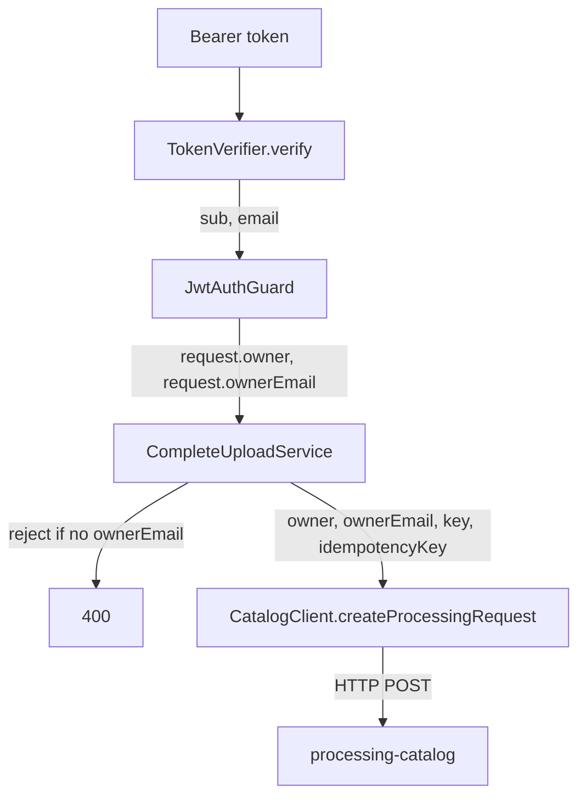

# Email Notification — API Design

**Spec**: `.specs/features/email-notification/spec.md`
**Status**: Draft

---

## Architecture Overview

The smallest of the four repos in this feature: no new port, no new adapter, just one widened return type threaded through three call sites that already exist.

`ownerEmail` is validated once, in `CompleteUploadService` — the one call site that needs it — not in the guard, which stays a pure authentication gate for every other route.

---

## Code Reuse Analysis

### Existing Components to Leverage

| Component | Location | How to Use |
| --- | --- | --- |
| `TokenVerifier` | `src/auth/token-verifier.ts` | Widened return type; `jwtVerify` call, issuer/audience/algorithm checks unchanged |
| `JwtAuthGuard` | `src/auth/jwt-auth.guard.ts` | Adds one field to `AuthenticatedRequest`; the authorization branch it already runs is untouched |
| `CompleteUploadService` | `src/uploads/complete-upload.service.ts` | Gains the same shape of upfront validation it already does for `Idempotency-Key` |
| `CatalogClient` port + `HttpCatalogClient` adapter | `src/processing-requests/ports/catalog-client.port.ts`, `.../adapters/http-catalog-client.adapter.ts` | `createProcessingRequest` gains one parameter; the request/response handling around it is unchanged |
| `InMemoryCatalogClientAdapter` | `src/processing-requests/adapters/in-memory-catalog-client.adapter.ts` | Test double, updated to accept and record the new parameter |

### Integration Points

| System | Integration Method |
| --- | --- |
| Keycloak (`identity`) | Unchanged transport (OIDC/JWKS); one more standard claim is read off the same verified token |
| `processing-catalog` | Same HTTP `POST /processing-requests` call, one more field in the body |

---

## Components

### `TokenVerifier`

- **Purpose**: Return the token's `email` claim alongside `sub`, still reading nothing else.
- **Location**: `src/auth/token-verifier.ts`
- **Interfaces**: `verify(token: string): Promise<{ sub: string; email?: string }>`
- **Dependencies**: `jose`, `SigningKeyCache` — unchanged
- **Reuses**: the existing `jwtVerify` call and its `requiredClaims`; `email` is read from the same `payload`, not required (a token can verify without it — that failure is handled downstream, not here, so this class keeps doing exactly one job: proving the token and reading claims off it)

The class comment's existing claim — "returns `sub` and nothing else, so no other claim can reach an authorization decision" — still holds: `email` is returned, but no authorization branch anywhere reads it. The comment is updated to say so explicitly, so the invariant stays legible to the next reader.

### `JwtAuthGuard`

- **Purpose**: Carry `email` onto the request the same way `sub` already is.
- **Location**: `src/auth/jwt-auth.guard.ts`
- **Interfaces**: `AuthenticatedRequest` gains `ownerEmail?: string`
- **Reuses**: the existing try/catch around `verifier.verify`; no new branch, no new exception type

### `OwnerEmail` decorator (new, tiny)

- **Purpose**: Parallel to the existing `Owner` decorator, for the one handler that needs it.
- **Location**: `src/auth/owner-email.decorator.ts`
- **Interfaces**: `createParamDecorator` returning `request.ownerEmail`
- **Reuses**: `owner.decorator.ts` as the template, unchanged pattern

### `CompleteUploadService`

- **Purpose**: Require the email and pass it on.
- **Location**: `src/uploads/complete-upload.service.ts`
- **Interfaces**: `execute(owner: string, ownerEmail: string | undefined, uploadId: string, idempotencyKey: string | undefined)`
- **Reuses**: the same upfront-validation style already used for `idempotencyKey` (`BadRequestException` with a clear message, before any storage or Catalog call)

### `CatalogClient` port and `HttpCatalogClient` adapter

- **Purpose**: Carry the email one HTTP hop.
- **Location**: `src/processing-requests/ports/catalog-client.port.ts`, `.../adapters/http-catalog-client.adapter.ts`
- **Interfaces**: `createProcessingRequest(ownerUserId, ownerEmail, sourceStorageKey, idempotencyKey)`
- **Reuses**: the existing `request()` helper and response-shape guards, unchanged beyond the new body field

---

## Data Models

None. This service persists nothing; `ownerEmail` only passes through memory for the duration of one request.

---

## Error Handling Strategy

| Error Scenario | Handling | User Impact |
| --- | --- | --- |
| Token verifies but carries no `email` claim (or a blank one) | `CompleteUploadService` throws `BadRequestException` before any storage or Catalog call | 400, naming the missing claim; no Processing Request created |
| Token's `email` is present but not a string (malformed/tampered payload that still verifies) | Treated as absent, same path as above | Same 400 |
| Every other route (`GET /processing-requests`, download, etc.) | No new check; `ownerEmail` is simply unused | No behavior change |

---

## Risks & Concerns

| Concern | Location (file:line) | Impact | Mitigation |
| --- | --- | --- | --- |
| Access tokens for `alice`/`bob` might not actually carry `email` (only the ID token does, if the mapper's "add to access token" is off) | `fiap-x-platform/identity/fiapx-realm.json` | Every upload confirmation would 400, blocking S7 entirely | Decode a real access token from `scripts/get-token.mjs` before writing the guard change; if absent, fix the realm's client scope mapper (a platform-repo change, not this one) rather than working around it here |
| A future reader adds an authorization check that reads `ownerEmail` | `jwt-auth.guard.ts` | Would silently reopen the exact coupling `TokenVerifier`'s comment was written to prevent | The updated class comment states the rule explicitly; a code-review checklist item, not a runtime guard, since there is no cheap way to enforce this in code without over-building |

> Lessons note: no confirmed lessons in `.specs/LESSONS.md` yet (all candidates, none promoted); nothing to load as guidance.

---

## Tech Decisions (only non-obvious ones)

| Decision | Choice | Rationale |
| --- | --- | --- |
| Where `ownerEmail` is required | In `CompleteUploadService`, not the guard | A missing optional claim is a precondition for one operation, not grounds to fail every authenticated route |
| No email-format validation | None added | The identity provider already asserts it; re-checking a claim from an authenticated token duplicates a guarantee that already exists upstream |
| New decorator vs. widening `Owner` | New `OwnerEmail` decorator | Keeps `Owner`'s existing contract (and every caller of it) untouched |

> **Project-level decisions:** AD-015 (email address resolved from the token's standard `email` claim, carried structurally to the terminal event only) is recorded in `fiap-x-platform/.specs/STATE.md` once implementation lands.
