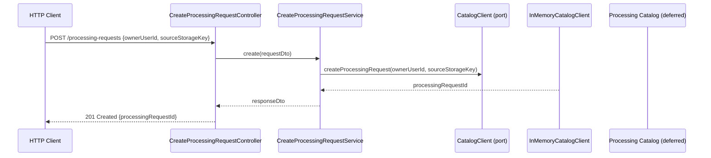

# API Initial Vertical Slice Design

**Spec**: `.specs/features/initial-vertical-slice/spec.md`
**Status**: Draft

---

## Architecture Overview

The FIAP X API first slice exposes a single HTTP endpoint that receives a controlled owner/source-key creation command and delegates it to the Processing Catalog through a local port. The API does not own Processing Request state; it only validates the input, invokes the Catalog client, and returns the resulting `processingRequestId`.



Note over Stub,Cat: In-memory stub in this slice; real transport replaces Stub later.

---

## Code Reuse Analysis

### Existing Components to Leverage

| Component | Location | How to Use |
| --- | --- | --- |
| NestJS scaffold | `src/app.module.ts`, `src/main.ts` | Extend with a new `ProcessingRequestsModule`. |
| Jest configuration | `package.json` | Use `npm test` for unit tests and `npm run test:e2e` for e2e tests. |
| ValidationPipe | `@nestjs/common` | Enable built-in pipe for DTO validation. |

### Integration Points

| System | Integration Method |
| --- | --- |
| Processing Catalog | `CatalogClient` port. Implementation is an in-memory stub in this slice; real AMQP/HTTP adapter replaces it later. |

---

## Components

### CreateProcessingRequestDto

- **Purpose**: Defines the validated JSON body for the creation endpoint.
- **Location**: `src/processing-requests/dtos/create-processing-request.dto.ts`
- **Interfaces**:
  - `ownerUserId: string` — controlled owner identifier.
  - `sourceStorageKey: string` — controlled source key.
- **Dependencies**: `class-validator` decorators (added in Execute).
- **Reuses**: NestJS DTO pattern.

### CreateProcessingRequestResponseDto

- **Purpose**: Defines the JSON returned after a successful Catalog delegation.
- **Location**: `src/processing-requests/dtos/create-processing-request-response.dto.ts`
- **Interfaces**:
  - `processingRequestId: string`
- **Dependencies**: none.
- **Reuses**: NestJS DTO pattern.

### CatalogClient (port)

- **Purpose**: Boundary that isolates the API from Catalog transport details.
- **Location**: `src/processing-requests/ports/catalog-client.port.ts`
- **Interfaces**:
  - `createProcessingRequest(ownerUserId: string, sourceStorageKey: string): Promise<string>` — returns `processingRequestId`.
- **Dependencies**: none.
- **Reuses**: Repository/port pattern.

### InMemoryCatalogClient

- **Purpose**: Controlled stub that satisfies the Catalog port for the first slice.
- **Location**: `src/processing-requests/adapters/in-memory-catalog-client.adapter.ts`
- **Interfaces**:
  - Implements `CatalogClient`.
- **Dependencies**: `CatalogClient` token.
- **Reuses**: Adapter pattern.

### CreateProcessingRequestService

- **Purpose**: Validates business preconditions and delegates creation to the Catalog port.
- **Location**: `src/processing-requests/services/create-processing-request.service.ts`
- **Interfaces**:
  - `execute(dto: CreateProcessingRequestDto): Promise<CreateProcessingRequestResponseDto>`
- **Dependencies**: `CatalogClient`.
- **Reuses**: NestJS service pattern.

### CreateProcessingRequestController

- **Purpose**: HTTP entry point for the controlled creation command.
- **Location**: `src/processing-requests/controllers/create-processing-request.controller.ts`
- **Interfaces**:
  - `POST /processing-requests` — accepts `CreateProcessingRequestDto`, returns `CreateProcessingRequestResponseDto`.
- **Dependencies**: `CreateProcessingRequestService`.
- **Reuses**: NestJS controller pattern.

---

## Data Models

### CreateProcessingRequestDto

```typescript
export class CreateProcessingRequestDto {
  ownerUserId: string;
  sourceStorageKey: string;
}
```

Validation: both fields are non-empty strings.

### CreateProcessingRequestResponseDto

```typescript
export class CreateProcessingRequestResponseDto {
  processingRequestId: string;
}
```

---

## Error Handling Strategy

| Error Scenario | Handling | User Impact |
| --- | --- | --- |
| Missing/invalid `ownerUserId` or `sourceStorageKey` | ValidationPipe throws `BadRequestException` | HTTP 400 |
| Catalog stub rejects creation | Service maps to a domain error; controller returns HTTP 502 | HTTP 502 |
| Unexpected error | NestJS global exception filter (default) | HTTP 500 |

---

## Risks & Concerns

> None found for this slice — the API owns no processing state and the Catalog transport is intentionally deferred.

---

## Tech Decisions

| Decision | Choice | Rationale |
| --- | --- | --- |
| Catalog transport | Deferred behind a port; in-memory stub in this slice | Keeps the slice focused on API-to-Catalog boundary ownership without requiring RabbitMQ/HTTP infrastructure. |
| Shared contracts | None; local DTOs only | Matches the MVP decision to use documented stable JSON and local DTOs. |
| DTO validation | NestJS `ValidationPipe` with `class-validator` | Standard NestJS approach; keeps input validation out of the service. |
| Service count | Four runtime services only | No additional runtime services are introduced. |
| AWS integration | Target only; not implemented in this slice | Cognito/S3/EKS are deferred to subsequent slices per the root spec. |
