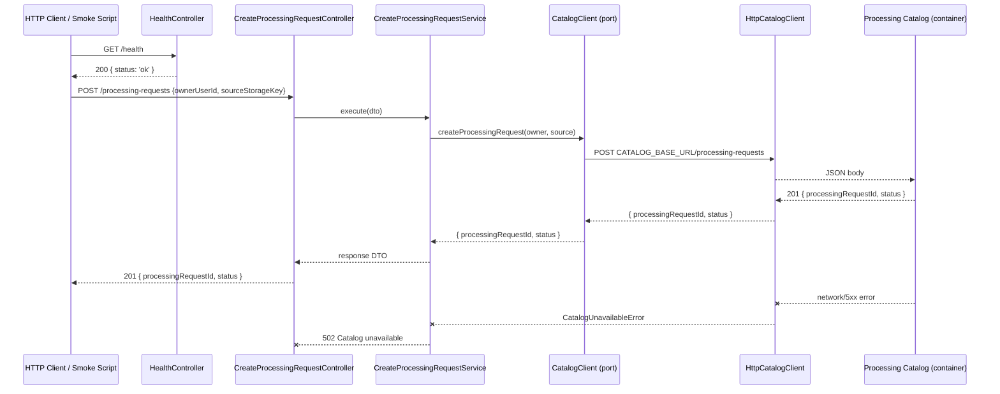
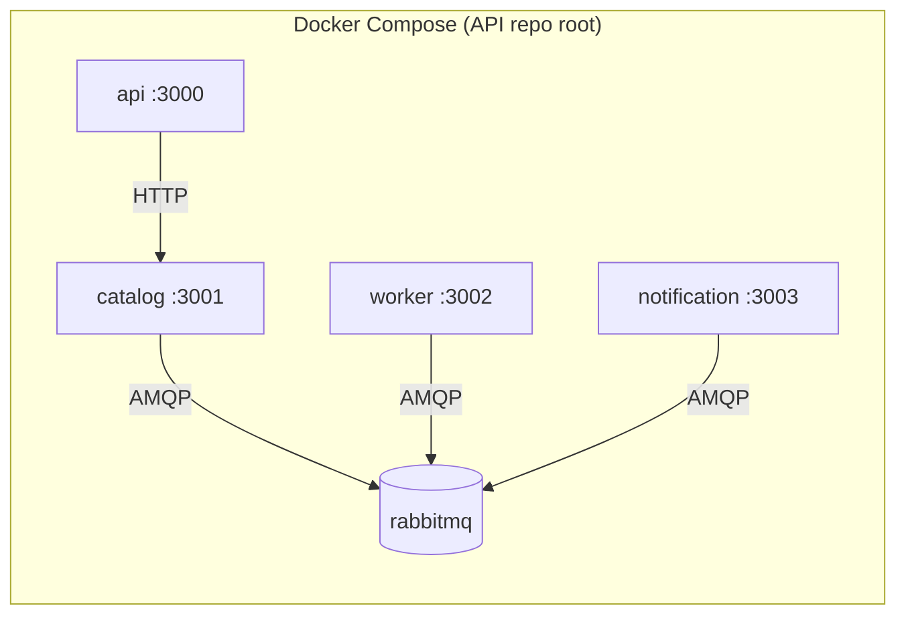

# API Local Docker Integration Design

**Spec**: `.specs/features/local-docker-integration/spec.md`
**Status**: Draft

---

## Architecture Overview

The API remains the HTTP edge for FIAP X. In this slice it swaps the in-memory Catalog stub for a real HTTP adapter, exposes a readiness endpoint, and owns the local Docker Compose topology plus the smoke script that proves the end-to-end path through RabbitMQ.



### Compose topology



The API does **not** own Catalog, Worker, Notification, or RabbitMQ business behavior. It owns the orchestration entrypoint (`compose.yaml` and `scripts/smoke-local-integration.mjs`) and its own container/health per project decision [AD-004](../../../.specs/STATE.md).

---

## Code Reuse Analysis

### Existing Components to Leverage

| Component | Location | How to Use |
| --- | --- | --- |
| NestJS scaffold | `src/app.module.ts`, `src/main.ts` | Register `HealthController`; wire Catalog adapter selection in `ProcessingRequestsModule`. |
| `CatalogClient` port | `src/processing-requests/ports/catalog-client.port.ts` | Extend return type from `Promise<string>` to an object carrying `processingRequestId` and `status`. |
| `InMemoryCatalogClient` | `src/processing-requests/adapters/in-memory-catalog-client.adapter.ts` | Keep as the default adapter when `CATALOG_BASE_URL` is not set (tests/local-dev). Update return shape. |
| `CreateProcessingRequestService` | `src/processing-requests/services/create-processing-request.service.ts` | Narrow the catch block so only catalog-unavailability maps to 502; let unexpected errors surface as 500. |
| `CatalogErrorFilter` | `src/processing-requests/filters/catalog-error.filter.ts` | Reuse for 502 response shaping; keep generic `HttpException` fallback. |
| ValidationPipe | `src/main.ts` | Keep global pipe; no changes. |
| Jest config | `package.json` | Keep unit + e2e commands; add typecheck of test files. |

### Integration Points

| System | Integration Method |
| --- | --- |
| Processing Catalog | HTTP `POST /processing-requests` and read-only request-state observation endpoint (local-only, enabled by `LOCAL_INTEGRATION=true` in Catalog). |
| RabbitMQ | Declared in `compose.yaml`; API does not connect directly. |
| Docker Compose | `compose.yaml` at API root defines the four services + broker; `scripts/smoke-local-integration.mjs` exercises the API path. |

---

## Components

### 1. `CatalogClient` port extension

- **Purpose**: Allow the Catalog adapter to return both the generated ID and the initial status so the API can satisfy the new response contract without adding state-transition logic.
- **Location**: `src/processing-requests/ports/catalog-client.port.ts`
- **Interface change**:
  ```typescript
  export interface CatalogClient {
    createProcessingRequest(
      ownerUserId: string,
      sourceStorageKey: string,
    ): Promise<{ processingRequestId: string; status: string }>;
  }
  ```
- **Dependencies**: none.
- **Reuses**: existing port.

### 2. `CreateProcessingRequestResponseDto` update

- **Purpose**: Carry `status` (`RECEIVED`) back to the caller per the local integration acceptance criteria.
- **Location**: `src/processing-requests/dtos/create-processing-request-response.dto.ts`
- **Fields**: `processingRequestId: string`, `status: string`.
- **Dependencies**: none.
- **Reuses**: existing local DTO pattern.

### 3. `InMemoryCatalogClient` update

- **Purpose**: Remains the default adapter for unit tests and local development without Catalog; now returns the new shape.
- **Location**: `src/processing-requests/adapters/in-memory-catalog-client.adapter.ts`
- **Behavior**: returns `{ processingRequestId: '<generated>', status: 'RECEIVED' }` on success; rejects with `new Error('Catalog rejected creation')` when configured to reject.
- **Dependencies**: `CatalogClient` port.
- **Reuses**: existing stub.

### 4. `CatalogUnavailableError`

- **Purpose**: Let the service distinguish a Catalog HTTP/network failure (502) from unexpected internal errors (500).
- **Location**: `src/processing-requests/errors/catalog-unavailable.error.ts`
- **Shape**: `class CatalogUnavailableError extends Error`.
- **Dependencies**: none.

### 5. `HttpCatalogClient`

- **Purpose**: Real HTTP adapter that posts to the Processing Catalog and maps network/5xx failures to a domain error.
- **Location**: `src/processing-requests/adapters/http-catalog-client.adapter.ts`
- **Implementation notes**:
  - Uses Node.js built-in `fetch` (Node 22 LTS) to avoid a new HTTP dependency.
  - Base URL injected via constructor: `catalogBaseUrl`.
  - Endpoint: `POST ${catalogBaseUrl}/processing-requests` with JSON body `{ ownerUserId, sourceStorageKey }`.
  - Expected success response: `201` with `{ processingRequestId: string; status: string }`.
  - On `fetch` rejection, non-2xx response, or malformed JSON: throws `CatalogUnavailableError`.
- **Dependencies**: `CatalogClient` port, `CatalogUnavailableError`.
- **Reuses**: adapter pattern.

### 6. `CreateProcessingRequestService` update

- **Purpose**: Preserve delegation to the port and correctly map error types to HTTP statuses.
- **Location**: `src/processing-requests/services/create-processing-request.service.ts`
- **Behavior**:
  - Returns the adapter's `{ processingRequestId, status }` directly as the response DTO.
  - Catches `CatalogUnavailableError` and throws `new HttpException('Catalog unavailable', HttpStatus.BAD_GATEWAY)`.
  - Lets any other error propagate so Nest's default filter returns `500`.
- **Dependencies**: `CatalogClient` token, `CatalogUnavailableError`.

### 7. `CreateProcessingRequestController`

- **Purpose**: No functional change; still receives DTO and delegates to service. Already returns `201 Created`.
- **Location**: `src/processing-requests/controllers/create-processing-request.controller.ts`
- **Dependencies**: `CreateProcessingRequestService`.

### 8. `HealthController`

- **Purpose**: Readiness endpoint for Compose health checks; reports that the local process can accept requests.
- **Location**: `src/health/health.controller.ts`
- **Route**: `GET /health`
- **Response**: `200` `{ status: 'ok' }`.
- **Dependencies**: none.
- **Reuses**: NestJS controller pattern.

### 9. `ProcessingRequestsModule` wiring

- **Purpose**: Select the Catalog adapter based on the runtime environment without adding a shared config package.
- **Location**: `src/processing-requests/processing-requests.module.ts`
- **Behavior**:
  - If `process.env.CATALOG_BASE_URL` is set, provide `CATALOG_CLIENT` with `HttpCatalogClient` instantiated with that URL.
  - Otherwise provide `InMemoryCatalogClient` (keeps tests and plain `npm run start:dev` working).
- **Dependencies**: `CreateProcessingRequestController`, `CreateProcessingRequestService`, `HttpCatalogClient`, `InMemoryCatalogClient`, `CatalogUnavailableError`.

### 10. `AppModule` update

- **Purpose**: Register the new `HealthController`.
- **Location**: `src/app.module.ts`
- **Change**: add `HealthController` to `controllers`.

### 11. API `Dockerfile`

- **Purpose**: Build a production-ready API container.
- **Location**: `Dockerfile` (repo root)
- **Design**:
  - Multi-stage build: `builder` compiles TypeScript, `runner` ships only production node_modules + `dist`.
  - Base image: `node:22-alpine` (current LTS, includes `fetch`).
  - Expose `3000`.
  - `CMD ["node", "dist/main"]`.
  - `.dockerignore` excludes `node_modules`, `dist`, `.git`, `.specs`, test files.

### 12. `compose.yaml`

- **Purpose**: Local cross-service entrypoint owned by the API repository.
- **Location**: `compose.yaml` (repo root)
- **Services**:
  - `api` — built from repo root, port `3000`, depends on `rabbitmq` and `catalog` health checks.
  - `catalog` — built from `../processing-catalog`, port `3001`, `LOCAL_INTEGRATION=true`.
  - `worker` — built from `../processing-worker`, port `3002`.
  - `notification` — built from `../notification-service`, port `3003`.
  - `rabbitmq` — `rabbitmq:4-management-alpine`, ports `5672` and `15672`.
- **Assumptions**: sibling services expose their own Dockerfile, health endpoint, and `PORT` env variable. The Catalog service exposes a read-only request-state observation route when `LOCAL_INTEGRATION=true`.

### 13. `scripts/smoke-local-integration.mjs`

- **Purpose**: Prove the local Docker path from API down to terminal observations.
- **Location**: `scripts/smoke-local-integration.mjs`
- **Behavior**:
  1. Wait for `GET http://localhost:3000/health`.
  2. `POST http://localhost:3000/processing-requests` with test owner/source key.
  3. Capture `processingRequestId`.
  4. Poll Catalog observation endpoint (`GET http://localhost:3001/processing-requests/{id}`) until status is `COMPLETED` or timeout.
  5. Poll Notification observation endpoint (`GET http://localhost:3003/deliveries/{id}` or equivalent) until a delivery record exists or timeout.
  6. Exit `0` on success, `1` on timeout or unexpected response.
- **Assumptions**: sibling services expose observation endpoints matching the local integration spec; the script does not own those contracts.

---

## Data Models / JSON Contracts

### Internal: `CatalogClient.createProcessingRequest` result

```typescript
{
  processingRequestId: string;
  status: string;
}
```

### HTTP: API → Catalog create request

```json
{
  "ownerUserId": "string",
  "sourceStorageKey": "string"
}
```

### HTTP: API → Catalog create response (assumed contract)

```json
{
  "processingRequestId": "string",
  "status": "RECEIVED"
}
```

### HTTP: API client create response

```json
{
  "processingRequestId": "string",
  "status": "RECEIVED"
}
```

---

## Environment Variables

| Variable | Required in local Docker | Default | Purpose |
| --- | --- | --- | --- |
| `PORT` | no | `3000` | API listen port. |
| `CATALOG_BASE_URL` | yes in Compose | none | Base URL of the Catalog HTTP API; when absent, API falls back to `InMemoryCatalogClient`. |

---

## Error Handling Strategy

| Error Scenario | Handling | User Impact |
| --- | --- | --- |
| Missing/invalid `ownerUserId` or `sourceStorageKey` | ValidationPipe | HTTP 400 |
| Catalog returns non-2xx or `fetch` fails (network/DNS) | `HttpCatalogClient` throws `CatalogUnavailableError`; service maps to `HttpException(502)` | HTTP 502 |
| Unexpected adapter/service error | Propagates to Nest default filter | HTTP 500 |
| Other unhandled exception | NestJS global exception filter | HTTP 500 |

---

## Risks & Concerns

| Concern | Mitigation |
| --- | --- |
| `CatalogClient` port return-type change breaks existing in-memory stub and service tests. | Update stub, service, DTO, and tests in the same phase (T1–T3). |
| `fetch` availability in Node runtime. | Dockerfile uses `node:22-alpine`; `fetch` is stable since Node 18. |
| Sibling services may not yet expose Dockerfiles/health endpoints. | Documented as external assumption; API owns only its own assets. |
| Smoke script depends on Catalog/Notification observation routes outside API ownership. | Script asserts against documented local-only endpoints; route details remain with sibling specs. |
| Unit test for 502 currently uses `toMatchObject` which does not assert numeric status. | Fix T6 asserts `err.getStatus()` and `err.message` explicitly. |

---

## Tech Decisions

| Decision | Choice | Rationale |
| --- | --- | --- |
| Catalog adapter selection | Env-driven factory in module | Keeps tests and local dev simple without a shared config package. |
| HTTP client | Node.js built-in `fetch` | Avoids new dependency; sufficient for one POST endpoint. |
| 502 vs 500 distinction | Custom `CatalogUnavailableError` | Matches the design's original intent and the local integration AC. |
| Compose ownership | API repo root (`compose.yaml`) | Project decision AD-004; API is the developer entrypoint. |
| Health endpoint | Simple custom controller | Readiness only; no extra dependency like `@nestjs/terminus`. |
| Multi-stage Dockerfile | `node:22-alpine`, separate builder/runner | Standard production image; keeps runtime image small. |

---

## API Gaps from Initial-Vertical-Slice Validation

The following items are explicitly carried over from `.specs/features/initial-vertical-slice/validation.md` and closed in this slice:

1. **Fix 1 — e2e TypeScript type error** (`test/processing-requests.e2e-spec.ts:26`): replace `get<CATALOG_CLIENT>` with `get<InMemoryCatalogClient>`.
2. **Fix 2 — service unit test weak status assertion** (`src/processing-requests/services/create-processing-request.service.spec.ts:59`): assert `err.getStatus()` and `err.message` instead of `toMatchObject`.
3. **Fix 3 — catch-all maps unexpected errors to 502**: narrow the service catch to `CatalogUnavailableError` so unexpected errors fall through as HTTP 500.

---

## Requirement Traceability

| Requirement ID | Design Element |
| --- | --- |
| API-01 | `compose.yaml`, `Dockerfile` |
| API-02 | `HttpCatalogClient`, `CatalogClient` port extension |
| API-03 | `CatalogUnavailableError`, service catch narrowing, `CatalogErrorFilter` |
| API-04 | `HealthController` |
| API-05 | `scripts/smoke-local-integration.mjs` |
| API-06 | Fix 1, Fix 2 (test/typing gaps) |
| API-07 | Retain `'**/._*'` ESLint ignore from previous slice |
