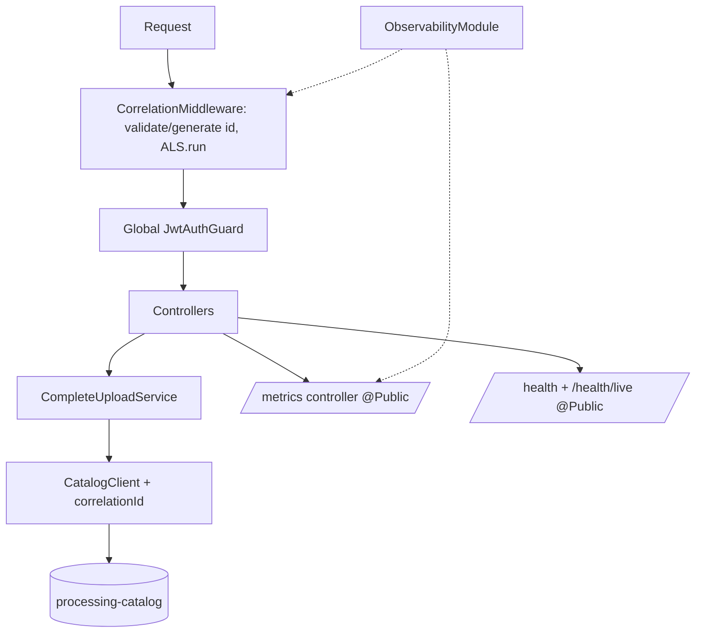

# Observability Design — FIAP X API

**Spec**: `.specs/features/observability/spec.md` (OBS-01..15)
**Status**: Draft

---

## Architecture Overview

One `ObservabilityModule` owns the three cross-cutting concerns: structured logging (nestjs-pino), the correlation context (a tiny AsyncLocalStorage wrapper), and metrics (prom-client on a dedicated registry). An edge middleware stamps every request with a validated `X-Correlation-Id` (or a generated uuid), stores it in the ALS, and pino's `mixin` injects it into every log line. The same ALS serves non-HTTP flows later (the other repos reuse the identical pattern). `CatalogClient` gains a `correlationId` parameter that rides as the `X-Correlation-Id` header and a body field.



---

## Code Reuse Analysis

### Existing Components to Leverage

| Component | Location | How to Use |
| --- | --- | --- |
| `HealthController` | `src/health/health.controller.ts` | Keep `@Public()`; add `health/live` route |
| `CatalogClient` port | `src/processing-requests/ports/catalog-client.port.ts:39` | Add `correlationId` param to `createProcessingRequest` |
| HTTP adapter | `src/processing-requests/adapters/http-catalog-client.adapter.ts:13` | Send `X-Correlation-Id` header + body field |
| In-memory adapter | `src/processing-requests/adapters/in-memory-catalog-client.adapter.ts:40` | Record the param for assertions |
| `CompleteUploadService` caller | `src/uploads/complete-upload.service.ts:152` | Pass the current correlation id |
| `CapturingLogger` test util | `test/support/capturing-logger.ts` | Still works — DI-level capture is unaffected by pino |

### Integration Points

| System | Integration Method |
| --- | --- |
| processing-catalog | `POST /processing-requests` body field `correlationId` + `X-Correlation-Id` header (catalog reads both, same value) |
| Prometheus (platform) | Scrapes `GET /metrics` on port 3000 every 15 s |
| Compose healthcheck | Already probes `/health`; unchanged |

---

## Components

### CorrelationContext

- **Purpose**: Hold the current request's correlation id for the lifetime of a request (ALS).
- **Location**: `src/observability/correlation-context.ts`
- **Interfaces**:
  - `runWithCorrelation(id: string, fn: () => T): T` - execute inside the context
  - `getCorrelationId(): string | undefined` - read (mixin uses this)
  - `parseCorrelationId(raw: unknown): string | null` - trim; accept only `/^[\x20-\x7E]{1,128}$/` (L-005 bound)
  - `getOrGenerateCorrelationId(): string` - parse or `randomUUID()`
- **Dependencies**: `node:async_hooks`, `node:crypto`
- **Reuses**: none — new, ~30 lines

### CorrelationMiddleware

- **Purpose**: Assign/validate the id at the edge and open the ALS scope.
- **Location**: `src/observability/correlation.middleware.ts`
- **Interfaces**: Nest middleware `use(req, res, next)`; reads `x-correlation-id`, falls back to generated, sets `res.setHeader('x-correlation-id', id)`, then `runWithCorrelation(id, next)`.
- **Dependencies**: CorrelationContext
- **Reuses**: pattern mirrors existing middleware registration in `AppModule`

### Pino root config

- **Purpose**: JSON logs everywhere with the correlation id and PII redaction.
- **Location**: `src/observability/logger.config.ts` (used by `LoggerModule.forRoot` in `AppModule`)
- **Interfaces**: exported config object: `pinoHttp: { genReqId: (req,res) => id-for-pino (mirrors middleware), autoLogging: { ignore: (req) => ['/health','/health/live','/metrics'].includes(req.url) }, customProps: () => ({ service: 'fiap-x-api' }), level via LOG_LEVEL (default info) }`; root `mixin: () => ({ correlationId: getCorrelationId() })` filtered when undefined; `redact: { paths: ['req.headers.authorization','req.headers.cookie','*.ownerEmail','*.email'], remove: true }`.
- **Dependencies**: `nestjs-pino`, `CorrelationContext`
- **Reuses**: nestjs-pino replaces the ad-hoc `new Logger()` calls transparently (`app.useLogger(app.get(Logger))`)

### ApiMetrics

- **Purpose**: Own the OBS-08..10 counters + HTTP traffic counters on a dedicated registry.
- **Location**: `src/observability/metrics.ts` (+ `metrics.controller.ts` exposing `GET /metrics`)
- **Interfaces**:
  - `recordUpload(outcome: 'accepted'|'rejected')` -> `fiapx_uploads_total`
  - `recordDownload(outcome: 'authorized'|'denied')` -> `fiapx_downloads_total`
  - HTTP middleware counting `fiapx_http_requests_total{method,route,status}` + `fiapx_http_request_duration_seconds`, route normalized to `'unmatched'` when no template matches (bounded cardinality)
  - `resetMetrics()` for tests; `registry.metrics(): Promise<string>` for the controller
- **Dependencies**: `prom-client`
- **Reuses**: none — new; registry is a per-app instance (not the prom-client global) so e2e suites don't leak counters

### Health endpoints

- **Purpose**: OBS-11/12 split.
- **Location**: `src/health/health.controller.ts`
- **Interfaces**: `GET /health` -> 200 `{status:'ok'}` while serving; `GET /health/live` -> 200. Both `@Public()`.
- **Dependencies**: none
- **Reuses**: existing controller; global `ValidationPipe`/`JwtAuthGuard` unaffected for `@Public` GETs

### CatalogClient correlation threading

- **Purpose**: OBS-03/04 — pass the id to the Catalog.
- **Location**: port + both adapters + `CompleteUploadService` caller
- **Interfaces**: `createProcessingRequest(input: CreateProcessingRequestInput & { correlationId?: string })`; HTTP adapter sets header `X-Correlation-Id` and body field.
- **Reuses**: S7 ownerEmail threading pattern, one more parameter end-to-end

---

## Data Models

```typescript
// request DTO addition (catalog-side contract, mirrored here for the client)
interface CreateProcessingRequestInput {
  // ...existing fields
  correlationId?: string; // <=128 printable ASCII, validated catalog-side
}
```

No local persistence — the API stores nothing new.

---

## Error Handling Strategy

| Error Scenario | Handling | User Impact |
| --- | --- | --- |
| Invalid `X-Correlation-Id` | Replaced with generated id, request proceeds (OBS-05) | None; response carries the generated id |
| pino stream write failure | pino `pino.destination` async — failure goes to stderr, never the request path | None |
| Metrics registry collection throws | Middleware wraps counting in try/catch; counting never throws into the controller | None |
| `/metrics` scraped while busy | Registry snapshot, independent of in-flight requests | Correct 200 |

---

## Risks & Concerns

| Concern | Location (file:line) | Impact | Mitigation |
| --- | --- | --- | --- |
| Global `JwtAuthGuard` would 401 the scraper | `src/auth/auth.module.ts` (APP_GUARD) | Prometheus gets 401 on `/metrics` | `@Public()` on the metrics controller (same as health) — covered by an e2e asserting 200 without a token |
| pino floods jest output in the 36 suites | `test/*` | Slower, noisier CI | Test bootstrap sets `LOG_LEVEL=fatal` (config reads env); log-shape assertions test serializer/mixin directly and via one stdout-capturing e2e |
| New e2e suites inherit the intermittent listen bug | `test/` (V40, spec G) | Flaky S8 suites | All new suites use `app.listen(0, '127.0.0.1')` via a shared `test/support/listen.ts` helper (already assumed by spec) |
| Redaction of the owner email relies on path names | log call sites | A future `logger.log({ owner_email })` slips through | Redact `*.ownerEmail` and `*.email`; the S7 no-log assertion e2e keeps running; spec G's `no-console` gate keeps arbitrary `console` out |
| `customProps`/mixin double-counting correlationId | logger.config | Duplicate JSON key | Single source: mixin reads ALS only; pino-http `genReqId` mirrors the middleware value |

---

## Tech Decisions (only non-obvious ones)

| Decision | Choice | Rationale |
| --- | --- | --- |
| Correlation storage | One ALS + one pino `mixin`; pino-http does NOT carry the context itself | Identical pattern in the 4 services; consumers (non-HTTP) use the same primitives |
| prom-client registry | Dedicated `Registry` per app, `resetMetrics()` for tests | Global singleton leaks counters across e2e suites in one jest worker |
| HTTP route label | Template path or `'unmatched'` | Bounded cardinality on 404s |
| `/health` semantics for the API | Always 200 while serving | No hard dependency (JWKS lazy); readiness flapping would be worse than useless |
| Exact package versions | Pinned at task time via npm (`nestjs-pino`, `prom-client` current stable) | Avoids pinning a fabricated version in the design |

> **Project-level decisions** (append to `.specs/STATE.md` during implementation): **AD-016** — `correlationId` is a first-class field of every event contract, originated at the API edge, persisted by the Catalog, propagated by the Worker, consumed by Notification; optional everywhere, strict-parse on read (L-010), ≤128 chars on write. **AD-017** — observability convention: nestjs-pino + prom-client, `fiapx_` metric prefix, bounded labels only (no PII/ids), `/health` readiness + `/health/live` liveness on all services, `/metrics` unauthenticated.
