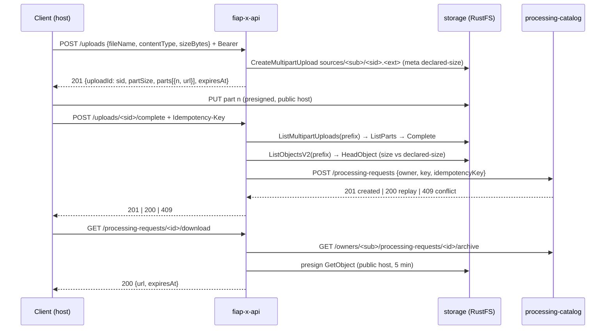

# Upload and Download Design — api

**Spec**: `.specs/features/upload-download/spec.md`
**Context**: `fiap-x-platform/.specs/features/upload-download/context.md` (locked decisions)
**Status**: Draft

---

## Project decisions this design conforms to

| Decision | How this design conforms |
| --- | --- |
| **AD-001** — services by responsibility | The API issues URLs and orchestrates confirmation; the Catalog stores the request and the idempotency key; storage holds the bytes. The API keeps no state of its own |
| **AD-003** — local DTOs, no shared package | The Catalog's new responses are re-declared here |
| **AD-005** — standard protocols | Storage is reached through the S3 API with `@aws-sdk/client-s3` and `@aws-sdk/s3-request-presigner`, the same SDK line `processing-worker` pins (`3.1137.0`); nothing RustFS-specific |
| **AD-014** — RustFS behind the S3 port; verify the server first | Every storage behaviour below was exercised against RustFS 1.0.0 in the spike |

**No new project-level decision is proposed.**

---

## Approaches considered (confirmed with the user on 2026-09-26)

Where does an upload's state live between start and confirmation (key, storage `UploadId`, owner, declared size)?

| Approach | Verdict |
| --- | --- |
| **In storage itself (chosen)** | Key `sources/<sub>/<sessionId>.<ext>`; the client's `uploadId` is the `sessionId`; the declared size rides as object metadata. Confirmation finds the upload under the caller's own prefix, so another user's id finds nothing. No table, no secret |
| A session table in the Catalog | A second source of truth beside storage, able to diverge when the lifecycle rule aborts an upload |
| An HMAC-signed upload token | Stateless too, but needs a secret shared by every API replica |

### Spike evidence (2026-09-26, RustFS 1.0.0 + `@aws-sdk/*` 3.1137.0)

| Question | Observed |
| --- | --- |
| Presigned `UploadPart` `PUT` to the signed host / another host | 200 / 403 — the signature pins the host, so the API must sign for the address the client uses |
| **Presigning with the SDK's default checksum** | **400 `BadDigest`** — the SDK embeds `x-amz-checksum-crc32` of an empty body; `requestChecksumCalculation: 'WHEN_REQUIRED'` fixes it (200) |
| `CreateMultipartUpload` `Metadata` read back by `HeadObject` after completion | `{"declared-size": "…"}` preserved, with `ContentLength` and `ContentType` |
| `ListMultipartUploads` by prefix | finds the caller's upload; another owner's prefix returns `[]` |
| `ListParts` → `CompleteMultipartUpload` | correct `ETag`s and sizes; completes |
| `CompleteMultipartUpload` replayed | `NoSuchUpload` |
| `ListParts` on an upload with no part | `[]` |
| `ListObjectsV2` by the session prefix after completion | the object |
| Presigned `GetObject` with `ResponseContentDisposition` | 200, full size, `attachment; filename="frames.zip"` |

---

## Architecture Overview



Two S3 clients share credentials: an **internal** one (`http://storage:9000`) for every call the API makes, and a **public** one (`STORAGE_PUBLIC_ENDPOINT`) used only to presign — presigning is offline, so the public client never opens a connection from inside the network.

---

## Code Reuse Analysis

| Component | Location | How to Use |
| --- | --- | --- |
| `@Owner()`, global guard | `src/auth/` | Every new route is authenticated by default |
| Fail-closed config pattern | `src/auth/oidc.config.ts` | `loadStorageConfig` refuses to start without its variables |
| `CatalogClient` port + HTTP/in-memory adapters | `src/processing-requests/ports`, `adapters/` | `createProcessingRequest` gains `idempotencyKey` and an outcome; new `getArchive` |
| `CatalogErrorFilter` (502 contract) | `src/processing-requests/filters/catalog-error.filter.ts` | Storage failures map to the same `502` |
| Constant 404 of S5 reads | `src/processing-requests/services/get-own-processing-request.service.ts` | Reused for download and for an unknown `uploadId` |
| S3 adapter shape | `processing-worker/src/storage/s3-object-storage.ts` | Same client options (`forcePathStyle`, fixed signing region) plus the checksum setting |
| Test key-set helpers | `test/support/` | New e2e suites authenticate the same way |

---

## Components

### StorageConfig

- **Location**: `src/storage/storage.config.ts`
- **Interfaces**: `loadStorageConfig(env): StorageConfig` — throws naming a missing variable
- **Variables**: `STORAGE_ENDPOINT`, `STORAGE_PUBLIC_ENDPOINT`, `STORAGE_BUCKET`, `STORAGE_ACCESS_KEY`, `STORAGE_SECRET_KEY` (required); `UPLOAD_URL_TTL_SECONDS` (default 3600), `DOWNLOAD_URL_TTL_SECONDS` (default 300)
- **Notes**: Fail-closed like `OidcConfig`: no silent in-memory fallback in the running app. Tests replace the storage provider explicitly with `overrideProvider`.

### UploadStorage port and adapters

- **Location**: `src/storage/upload-storage.port.ts`, `src/storage/s3-upload-storage.ts`, `test/support/in-memory-upload-storage.ts`
- **Interfaces**:
  - `startMultipart(key, contentType, declaredSize): Promise<string>` — the storage `UploadId`
  - `presignPart(key, storageUploadId, partNumber, ttlSeconds): Promise<string>`
  - `findInProgress(prefix): Promise<{ key; storageUploadId } | undefined>`
  - `listParts(key, storageUploadId): Promise<{ partNumber; etag; size }[]>`
  - `complete(key, storageUploadId, parts): Promise<'completed' | 'gone'>` — `'gone'` on `NoSuchUpload`
  - `findObject(prefix): Promise<{ key; sizeBytes; declaredSizeBytes } | undefined>`
  - `deleteObject(key): Promise<void>`
  - `presignGet(key, ttlSeconds, downloadName): Promise<string>`
- **Notes**: Both S3 clients use `requestChecksumCalculation: 'WHEN_REQUIRED'` and `responseChecksumValidation: 'WHEN_REQUIRED'` (spike: the default breaks every presigned part). Absence is a return value, not an exception. Any other storage error becomes `StorageUnavailableError`.

### StartUploadService

- **Location**: `src/uploads/start-upload.service.ts`
- **Interfaces**: `execute(owner, { fileName, contentType, sizeBytes }): Promise<StartedUpload>`
- **Notes**: `sessionId = randomUUID()`, `ext` from `fileName` lowercased, key `sources/<owner>/<sessionId>.<ext>`; `parts = ceil(sizeBytes / 16 MiB)`; presigns each part; `expiresAt = now + UPLOAD_URL_TTL_SECONDS`. Returns `uploadId = sessionId` — never the key.

### CompleteUploadService

- **Location**: `src/uploads/complete-upload.service.ts`
- **Interfaces**: `execute(owner, uploadId, idempotencyKey): Promise<{ outcome: 'created' | 'replayed'; request }>`
- **Algorithm** (each branch is a spec AC):
  1. `uploadId` not a UUID → 404. `prefix = sources/<owner>/<uploadId>.`
  2. `findInProgress(prefix)` → if found: `listParts` (empty → 400 "no part uploaded"), `complete` (`'gone'` means a concurrent confirmation won — fall through)
  3. `findObject(prefix)` → none → 404 (never started, another owner's id, or aborted by the lifecycle rule)
  4. `sizeBytes ≠ declaredSizeBytes` → `deleteObject`, 400 naming the size
  5. `catalog.createProcessingRequest(owner, key, idempotencyKey)` → `created` → 201, `replayed` → 200, `conflict` → 409
- **Why it is safe to retry**: every step is idempotent or detects its own completion; the only non-idempotent effect, creating the request, is made idempotent by the Catalog's `(owner, idempotencyKey)` unique constraint. A failure at any step before 5 leaves the key unused.

### DownloadService

- **Location**: `src/processing-requests/services/download.service.ts`
- **Interfaces**: `execute(owner, id): Promise<{ url; expiresAt }>`
- **Notes**: `catalog.getArchive(owner, id)` → `{ zipStorageKey }` → `presignGet(key, DOWNLOAD_URL_TTL_SECONDS, 'frames-<id>.zip')`; `'not-completed'` → 409; `undefined` → the constant 404.

### UploadsController and the removed route

- **Location**: `src/uploads/uploads.controller.ts`; `POST /processing-requests`, `CreateProcessingRequestService` and its DTO are deleted; `GET /processing-requests/:id/download` joins `ProcessingRequestsController`
- **DTOs**: `StartUploadDto` (`fileName` string ≤ 255 ending `.mp4`/`.mov` case-insensitively; `contentType` matching the extension; `sizeBytes` integer 1–524 288 000); `Idempotency-Key` header: 1–255 printable ASCII characters

---

## Data Models

```typescript
interface StartedUpload { uploadId: string; partSize: number; parts: { partNumber: number; url: string }[]; expiresAt: string }
type CatalogCreateOutcome =
  | { outcome: 'created' | 'replayed'; processingRequestId: string; status: string }
  | { outcome: 'conflict' }
type CatalogArchive = { zipStorageKey: string } | 'not-completed' | undefined
```

---

## Error Handling Strategy

| Scenario | Handling | Client sees |
| --- | --- | --- |
| Invalid `fileName` / `contentType` / `sizeBytes` | `ValidationPipe` / explicit checks, before storage is touched | 400 naming the field |
| `Idempotency-Key` missing, blank or malformed | Checked before storage is touched | 400 |
| Unknown / other owner's / aborted `uploadId` | Nothing under the caller's prefix | 404 (constant) |
| No part uploaded | `listParts` empty | 400 |
| Real size ≠ declared | Object deleted | 400 naming the size |
| Concurrent confirmations | Loser's `complete` → `'gone'`; both reach the Catalog; the unique key returns one request | 201 and 200 with the same id |
| Key bound to another upload | Catalog 409 | 409 |
| Request not `COMPLETED` on download | Catalog 409 | 409 |
| Storage or Catalog unreachable | `StorageUnavailableError` / `CatalogUnavailableError` | 502 |

---

## Risks & Concerns

| Concern | Location | Impact | Mitigation |
| --- | --- | --- | --- |
| **The SDK's default checksum breaks presigned parts** | S3 client options (spike) | Every real upload fails with `BadDigest` | `requestChecksumCalculation: 'WHEN_REQUIRED'` on both clients; the S3 adapter's integration test uploads a real part through a presigned URL |
| **A URL signed for the internal host is useless to the client** | `STORAGE_PUBLIC_ENDPOINT` | Every URL 403s from the host | A separate presigning client; the platform smoke `PUT`s from the host |
| **Silent in-memory fallback** | `src/processing-requests/processing-requests.module.ts` (Catalog) | The S3 path could ship unreferenced | `loadStorageConfig` fails closed; a composition e2e asserts the S3 adapter is bound when configured and boot fails without config |
| **The Catalog dedups by a per-call `eventId`** | `processing-catalog/src/interface/create-processing-request.controller.ts:19` | Its existing dedup never matches an API retry | Idempotency comes from the new `(owner, idempotencyKey)` constraint (Catalog UPL-11/12); the API passes the client's key, never a fresh one |
| **Existing e2e suites create through `POST /processing-requests`** | `test/*.e2e-spec.ts` | They break when the route is removed | Rewritten to the upload flow against the in-memory storage double, or deleted where they only tested the removed route — each change listed, no assertion weakened |
| **Presigned URLs in logs** | — | A leaked log would grant access | No URL is ever logged; an e2e asserts log output contains no `X-Amz-Signature` |
| **S3 adapter test needs a real server in CI** | `.github/workflows/ci.yml` | Would skip or be untested | CI starts `rustfs/rustfs:1.0.0` as `processing-worker` does; the suite fails instead of skipping when `CI` is set and no endpoint is configured |

---

## Tech Decisions (only non-obvious ones)

| Decision | Choice | Rationale |
| --- | --- | --- |
| Upload state | Storage (prefix + metadata) | Confirmed; proven in the spike |
| Presigning client | Separate client on the public endpoint | The signature binds the host |
| Checksums | `WHEN_REQUIRED` | Spike: the default embeds an empty-body CRC32 |
| Part size | 16 MiB fixed | ≤ 32 parts at 500 MiB; above S3's 5 MiB minimum |
| Download file name | `frames-<processingRequestId>.zip` via `ResponseContentDisposition` | A useful name without exposing the key |
