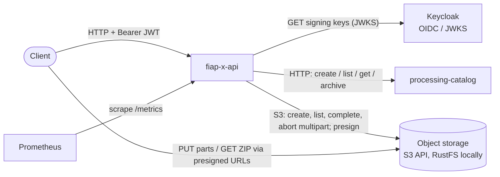

# fiap-x-api

The public HTTP edge of FIAP X, a video-processing system built for the FIAP POSTECH SOAT phase 5 hackathon. It authenticates users with an OIDC access token, lets them upload a video straight to object storage through presigned multipart URLs, confirms the upload idempotently by creating a Processing Request in [`processing-catalog`](https://github.com/tech-challenge-workshop/processing-catalog), and shows each user only their own requests and the ZIP of frames once it is ready. It is one of five repositories; the system as a whole, its local topology and its decision log live in [`fiap-x-platform`](https://github.com/tech-challenge-workshop/fiap-x-platform).



**What it does not do.** It never receives video bytes (the client sends them to storage), never touches RabbitMQ, owns no database and no Processing Request state, runs no FFprobe/FFmpeg, and sends no email. Lifecycle and events belong to `processing-catalog`, processing to [`processing-worker`](https://github.com/tech-challenge-workshop/processing-worker), email to [`notification-service`](https://github.com/tech-challenge-workshop/notification-service).

## Responsibilities and boundaries

| Owns | Delegates |
| --- | --- |
| Bearer JWT validation and the owner (`sub`) of every call | Issuing tokens, users, the realm: Keycloak, configured in the platform |
| Validating the declared file (name, type, size) and generating the storage key | Checking the real content (codec, duration): the Worker's FFprobe step |
| Presigning multipart part URLs and the ZIP download URL | Bucket, credentials, lifecycle rules: the platform's storage setup |
| Confirming an upload: completing the multipart, checking the size, creating the request | Durable idempotency, lifecycle, events: `processing-catalog` |
| Owner-scoped reads, projected through an allow-list | The owner-filtered queries themselves: `processing-catalog` |
| The correlation id, logs and request metrics of the edge | Scraping, dashboards: the platform's Prometheus/Grafana |

### Peculiarities worth knowing

- **Pinned issuer, pinned key set.** Tokens are verified with `jose` against `OIDC_ISSUER` and `OIDC_AUDIENCE`, `RS256` only, with `exp` and `sub` required. The key set is fetched from `OIDC_JWKS_URL` (not discovered), cached with no expiry, and refetched only for an unknown `kid`, one fetch shared by concurrent callers and bounded by `OIDC_JWKS_TIMEOUT_MS`. A bad or missing token is `401`; a key set that cannot be fetched is `503`. Keys already cached keep working while Keycloak is down.
- **Everything is protected unless `@Public()`.** `JwtAuthGuard` is a global guard. Only `/health`, `/health/live` and `/metrics` are public.
- **Owner scoping.** The owner is always the token's `sub`, never a request field. Another user's id, an unknown id and a malformed id get the same `404` body, so a response never reveals which requests or uploads exist. Responses copy an allow-list of fields (`projection.ts`), so a field the Catalog adds later never reaches a user by default; `failureReason` is shown only on `FAILED`.
- **Email claim, not authorization.** The token's `email` claim is read only to pass it to the Catalog on confirmation, for the failure email (AD-015). Confirmation answers `400` when the token carries no `email`.
- **Presigned multipart upload, 16 MiB parts.** `POST /uploads` generates the key `sources/<sub>/<uploadId>.<mp4|mov>`, starts a multipart upload with the declared size as object metadata, and returns one presigned `PUT` URL per 16 MiB part (`partSize: 16777216`). There is no upload table: storage itself is the state. On confirmation the API lists the parts itself and completes the upload; parts storage refuses are a `400` and the upload is aborted, a size that differs from the declared one is a `400` and the object is deleted. Accepted input: `.mp4` with `video/mp4` or `.mov` with `video/quicktime`, 1 to 524288000 bytes.
- **Two storage endpoints.** Calls go to `STORAGE_ENDPOINT`; URLs are signed for `STORAGE_PUBLIC_ENDPOINT`, because a signature binds the host the client will use. Presigning is offline.
- **Idempotent confirmation.** `POST /uploads/:uploadId/complete` requires an `Idempotency-Key` header (1 to 255 printable ASCII characters). `201` creates the request, `200` replays it (same key, or the same upload under another key), `409` means the key is already bound to another upload. Every step tolerates a concurrent or retried confirmation; the Catalog's unique key makes the creation itself exactly-once.
- **Correlation id born at the edge (AD-016).** The caller's `X-Correlation-Id` is kept when it is 1 to 128 printable ASCII characters after trimming, otherwise a UUID is generated. It is echoed on the response, carried in an `AsyncLocalStorage` context onto every log line, and sent to the Catalog on creation as both a header and a body field.
- **Never logged.** Authorization and cookie headers, `email`/`ownerEmail`, and `sourceStorageKey`/`zipStorageKey` are removed by the logger's redact paths (root and one level deep). The code never logs a presigned URL or an object key, and storage errors keep only the SDK error's name.
- **Errors on API routes** are shaped `{ statusCode, message }`. The Catalog or storage being unreachable is `502`.
- **No Catalog configured means an in-memory Catalog.** When `CATALOG_BASE_URL` is unset, `InMemoryCatalogClient` is used: fine for tests, not persisted. Storage has no such fallback; the app refuses to boot without its configuration.

## Architecture

A NestJS modular monolith with ports and adapters around its two outbound dependencies. Controllers and services depend on the `CatalogClient` and `UploadStorage` ports (injection tokens `CATALOG_CLIENT` and `UPLOAD_STORAGE`); adapters are bound in the module factories, and tests swap them for in-memory doubles.

```text
src/
├── main.ts                      bootstrap: pino logger, global ValidationPipe, PORT
├── app.module.ts                module wiring; correlation + HTTP metrics middleware on every route
├── auth/                        global JwtAuthGuard, TokenVerifier, SigningKeyCache, @Public/@Owner/@OwnerEmail, OIDC config
├── health/                      public /health and /health/live
├── observability/               correlation context and middleware, pino config and redaction, prom-client registry, /metrics
├── storage/                     UploadStorage port, S3 adapter, in-memory double, storage config (fails closed)
├── uploads/                     POST /uploads and its confirmation; DTO validation, 16 MiB part planning
└── processing-requests/         owner-scoped reads and downloads
    ├── controllers/             /processing-requests routes
    ├── services/                list, get, download use cases
    ├── ports/                   CatalogClient port and its types (DTOs re-declared locally, AD-003)
    ├── adapters/                HTTP Catalog client (fetch) and in-memory Catalog
    ├── dtos/                    page/pageSize query validation
    ├── errors/                  CatalogUnavailableError
    └── filters/                 { statusCode, message } error shape; Catalog/storage outage as 502
```

| Design choice | Source |
| --- | --- |
| Separate repository, one HTTP call to the Catalog, no shared tables or code | AD-001, AD-007 |
| Local DTOs, no shared contracts package | AD-003 |
| Standard protocols only (OIDC/JWKS, S3 API); no provider SDK or claim in the application layer | AD-005 |
| S3 client with a fixed signing region and path-style addressing, so RustFS or any S3 server works | AD-005, AD-014 |
| No cache tier: idempotency lives in the Catalog's database and in deterministic keys | AD-008 |
| Owner email read from the token's `email` claim, passed on confirmation only | AD-015 |
| Correlation id assigned at the edge and propagated to the Catalog | AD-016 |
| nestjs-pino JSON logs with redaction; prom-client on the app's own registry; unauthenticated `/metrics` | AD-017 |
| Multi-arch images on GHCR, `:main` pulled by the local kind cluster | AD-018 |

The decision log is [`fiap-x-platform/.specs/STATE.md`](https://github.com/tech-challenge-workshop/fiap-x-platform/blob/main/.specs/STATE.md).

## HTTP API

| Method | Path | Auth | Purpose | Main status codes |
| --- | --- | --- | --- | --- |
| `POST` | `/uploads` | Bearer | Start an upload. Body `{ fileName, contentType, sizeBytes }`; returns `{ uploadId, partSize, parts: [{ partNumber, url }], expiresAt }` | `201`, `400` invalid field, `401`, `502` storage |
| `POST` | `/uploads/:uploadId/complete` | Bearer + `Idempotency-Key` | Confirm the upload and create the Processing Request; returns `{ processingRequestId, status }` | `201` created, `200` replayed, `400` (no key, no `email` claim, no parts, invalid parts, size mismatch), `404`, `409` key reused, `502` |
| `GET` | `/processing-requests` | Bearer | List the caller's requests, newest first. Query `page` (default 1), `pageSize` (1 to 100, default 20); returns `{ items, page, pageSize, total }` | `200`, `400`, `401`, `502` |
| `GET` | `/processing-requests/:id` | Bearer | One of the caller's requests: `processingRequestId`, `status`, `createdAt`, `updatedAt`, `failureReason` (only when `FAILED`) | `200`, `404`, `401`, `502` |
| `GET` | `/processing-requests/:id/download` | Bearer | A new short-lived URL for the ZIP (`frames-<id>.zip`); returns `{ url, expiresAt }` | `200`, `404`, `409` not `COMPLETED`, `401`, `502` |
| `GET` | `/health` | Public | Readiness: `{ status: "ok" }` while the app serves (no dependency check; the key set is fetched lazily) | `200` |
| `GET` | `/health/live` | Public | Liveness: `{ status: "ok" }` | `200` |
| `GET` | `/metrics` | Public | Prometheus exposition (`text/plain; version=0.0.4`) | `200` |
| `GET` | `/` | Bearer | Nest scaffold leftover, returns `Hello World!` | `200`, `401` |

Every protected route answers `401` without a valid token and `503` when the key set cannot be fetched. Unknown body fields are rejected (`whitelist` + `forbidNonWhitelisted`). The end-to-end flow with `curl` is in the platform README, [Uploading a video and downloading its frames](https://github.com/tech-challenge-workshop/fiap-x-platform#uploading-a-video-and-downloading-its-frames).

## Tech stack

| Area | Choice (version from `package.json`) |
| --- | --- |
| Runtime | Node.js 22 (`node:22-alpine` image, CI `node-version: 22`), TypeScript `^5.7.3` |
| Framework | NestJS `^11.0.1` (`@nestjs/common`, `core`, `platform-express`) |
| Validation | `class-validator` `^0.15.1`, `class-transformer` `^0.5.1` |
| Auth | `jose` `6.2.12` |
| Storage | `@aws-sdk/client-s3` and `@aws-sdk/s3-request-presigner` `3.1137.0` |
| Logs / metrics | `nestjs-pino` `^5.2.1`, `prom-client` `^15.1.3` |
| Tests / quality | Jest `^30.0.0` with `ts-jest`, `supertest` `^7.0.0`, ESLint `^9.18.0` + Prettier `^3.4.2` |

### Observability

- **Logs**: one JSON object per line with `service: "fiap-x-api"`, `timestamp`, and `correlationId` inside a request. Level from `LOG_LEVEL`. No access-log line for `/health`, `/health/live` or `/metrics`.
- **Metrics** (`/metrics`, dedicated registry, no default process metrics):

| Family | Type | Labels |
| --- | --- | --- |
| `fiapx_uploads_total` | counter | `outcome` = `accepted` (a confirmation that created a request) or `rejected` (a `400` on `POST /uploads`) |
| `fiapx_downloads_total` | counter | `outcome` = `authorized` or `denied` (`404`/`409`) |
| `fiapx_http_requests_total` | counter | `method`, `route` (template, or `unmatched`), `status` |
| `fiapx_http_request_duration_seconds` | histogram | `method`, `route`, `status` |

## Configuration

Every variable the code reads (`src/**/*.config.ts`, `main.ts`, `processing-requests.module.ts`). There is no `.env` file in the repository; the platform's [`compose.yaml`](https://github.com/tech-challenge-workshop/fiap-x-platform/blob/main/compose.yaml) sets the local values.

| Variable | Required | Default | Purpose |
| --- | --- | --- | --- |
| `PORT` | no | `3000` | HTTP listen port |
| `OIDC_ISSUER` | yes | | Exact `iss` a token must carry (locally `http://localhost:8080/realms/fiapx`) |
| `OIDC_AUDIENCE` | yes | | Required `aud` (locally `fiapx-api`) |
| `OIDC_JWKS_URL` | yes | | Key set URL, fetched directly, not discovered |
| `OIDC_JWKS_TIMEOUT_MS` | no | `2000` | Timeout of one key set fetch; positive integer |
| `STORAGE_ENDPOINT` | yes | | S3 endpoint the API calls (locally `http://storage:9000`) |
| `STORAGE_PUBLIC_ENDPOINT` | yes | | Host presigned URLs are signed for (locally `http://localhost:9000`) |
| `STORAGE_BUCKET` | yes | | Bucket for sources and ZIPs |
| `STORAGE_ACCESS_KEY` | yes | | S3 access key |
| `STORAGE_SECRET_KEY` | yes | | S3 secret key |
| `UPLOAD_URL_TTL_SECONDS` | no | `3600` | Lifetime of part URLs; positive integer |
| `DOWNLOAD_URL_TTL_SECONDS` | no | `300` | Lifetime of the ZIP URL; positive integer |
| `CATALOG_BASE_URL` | no | unset | Catalog base URL (locally `http://catalog:3001`); unset selects the in-memory Catalog |
| `LOG_LEVEL` | no | `info` | pino level |

A missing required variable or a non-positive TTL/timeout stops the app at boot with `<NAME> is required` or `<NAME> must be a positive integer`.

Test-only variables, read by `test/s3-upload-storage.e2e-spec.ts`: `STORAGE_TEST_ENDPOINT` (a `localhost` or `127.0.0.1` S3 endpoint; the suite is skipped without it, and fails when `CI` is set), `STORAGE_TEST_ACCESS_KEY` / `STORAGE_TEST_SECRET_KEY` (default `fiapx-dev` / `fiapx-dev-secret`), `STORAGE_TEST_BUCKET` (default `fiapx-api-test`, created by the suite).

## Running

### With the whole system (recommended)

The platform's Compose stack builds this repository from `../fiap-x-api`, so check out all five repositories under one parent directory, then from `fiap-x-platform`:

```sh
docker compose up --build -d --wait
TOKEN=$(node scripts/get-token.mjs alice)
curl -H "Authorization: Bearer $TOKEN" http://localhost:3000/processing-requests
```

See the platform README: [Running locally](https://github.com/tech-challenge-workshop/fiap-x-platform#running-locally), [Logging in as a demo user](https://github.com/tech-challenge-workshop/fiap-x-platform#logging-in-as-a-demo-user), [Observability](https://github.com/tech-challenge-workshop/fiap-x-platform#observability) and [Local Kubernetes (kind)](https://github.com/tech-challenge-workshop/fiap-x-platform#local-kubernetes-kind).

### Just this service

```sh
npm ci
export OIDC_ISSUER=http://localhost:8080/realms/fiapx OIDC_AUDIENCE=fiapx-api \
  OIDC_JWKS_URL=http://localhost:8080/realms/fiapx/protocol/openid-connect/certs \
  STORAGE_ENDPOINT=http://localhost:9000 STORAGE_PUBLIC_ENDPOINT=http://localhost:9000 \
  STORAGE_BUCKET=fiapx STORAGE_ACCESS_KEY=fiapx-dev STORAGE_SECRET_KEY=fiapx-dev-secret
npm run start:dev
```

This needs a reachable Keycloak and S3 endpoint (for example the platform's `identity` and `storage` containers). Without `CATALOG_BASE_URL` the in-memory Catalog is used; set it to a running Catalog for real requests.

### Scripts

| Script | What it does |
| --- | --- |
| `npm run start` / `start:dev` / `start:debug` | `nest start`, with `--watch`, with `--debug --watch` |
| `npm run build` then `npm run start:prod` | Compile to `dist/`, run `node dist/main` |
| `npm test` / `test:watch` / `test:cov` | Unit tests (`src/**/*.spec.ts`) |
| `npm run test:e2e` | End-to-end tests (`test/*.e2e-spec.ts`) |
| `npm run lint` / `lint:fix` | ESLint with `--max-warnings 0` |
| `npm run typecheck` | `tsc --noEmit` |
| `npm run format` | Prettier over `src` and `test` |

### Tests

- **Unit** (`src/**/*.spec.ts`): services, adapters, config loaders, auth and observability pieces, with no external service.
- **End-to-end** (`test/`): the whole `AppModule` over HTTP with `supertest`, with no external service either. `test/support` starts a local JWKS server and signs tokens, sets the storage environment, and overrides `UPLOAD_STORAGE` with `InMemoryUploadStorage`; the Catalog is the in-memory adapter. The exception is `s3-upload-storage.e2e-spec.ts`, which runs the S3 adapter against a real endpoint given in `STORAGE_TEST_ENDPOINT`, for example:

```sh
docker run -d --name storage -p 9000:9000 \
  -e RUSTFS_ACCESS_KEY=fiapx-dev -e RUSTFS_SECRET_KEY=fiapx-dev-secret rustfs/rustfs:1.0.0
STORAGE_TEST_ENDPOINT=http://localhost:9000 npm run test:e2e
```

### Docker image

The `Dockerfile` is two-stage on `node:22-alpine`: build with `npm ci` and `npm run build`, then a runtime stage with production dependencies only, `EXPOSE 3000`, `CMD ["node", "dist/main"]`.

```sh
docker build -t fiap-x-api .
```

### CI

[`.github/workflows/ci.yml`](.github/workflows/ci.yml) runs on pull requests to `main` and pushes to `main`:

| Job | Steps |
| --- | --- |
| `quality` | `npm ci`, lint, typecheck, `npm test -- --coverage`, start RustFS `1.0.0`, `npm run test:e2e` with `STORAGE_TEST_ENDPOINT`, build, upload the coverage artifact |
| `image` | After `quality`: Buildx + QEMU build for `linux/amd64` and `linux/arm64`. On a push to `main` only, logs in with `GITHUB_TOKEN` and pushes `ghcr.io/tech-challenge-workshop/fiap-x-api:<sha>` and `:main`; pull requests build without pushing |

## Links

- System, topology and decisions: [`fiap-x-platform`](https://github.com/tech-challenge-workshop/fiap-x-platform), [decision log](https://github.com/tech-challenge-workshop/fiap-x-platform/blob/main/.specs/STATE.md)
- Sibling services: [`processing-catalog`](https://github.com/tech-challenge-workshop/processing-catalog), [`processing-worker`](https://github.com/tech-challenge-workshop/processing-worker), [`notification-service`](https://github.com/tech-challenge-workshop/notification-service)
- This service's feature specs: [`.specs/features/`](.specs/features/) (auth and owner scope, upload and download, email claim, API hardening, observability, CI)
- Service docs: [service boundary](docs/service-boundary.md), [roadmap](docs/ROADMAP.md)
